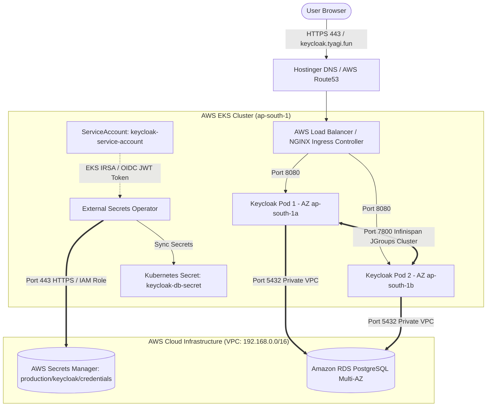
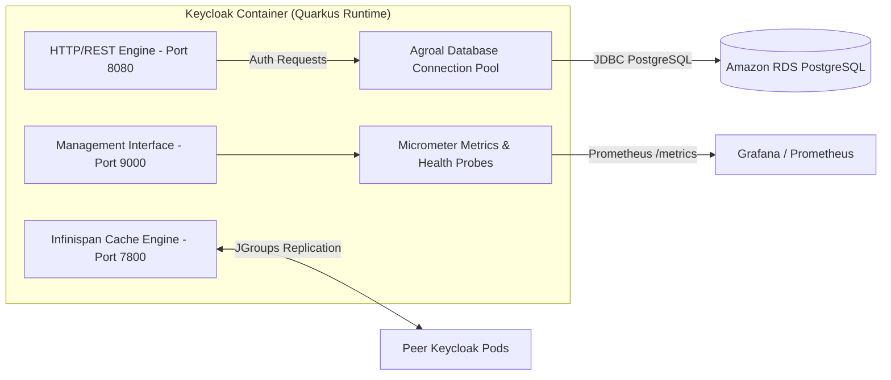
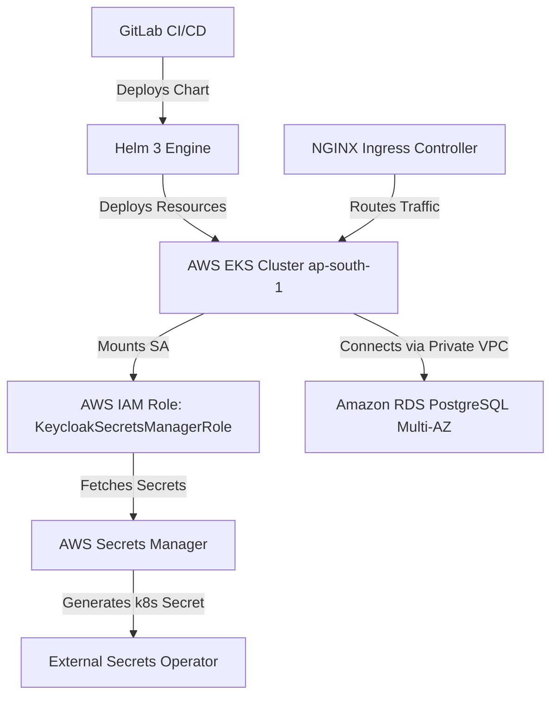

# Keycloak Enterprise Production Design & Deliverable Matrix

| Phase | Work Item | Deliverable | Details & Artifacts |
| :--- | :--- | :--- | :--- |
| **Design** | Infrastructure Diagram | Infrastructure Diagram | Multi-AZ AWS EKS & RDS Architecture Diagram |
| | Application Architecture | Component Diagram | Keycloak Quarkus Engine, Infinispan, & Agroal Pool |
| | Repository Strategy | VCS Directory Structure | Version-controlled Helm Chart Repository Layout |
| | Observability (o11y) | Metrics, Dashboards, & Alerts | Prometheus Metrics, Grafana, & Alertmanager Specs |
| | Security Indicators | Zero-Trust Controls | IRSA, ESO, VPC CNI eBPF NetworkPolicy, Non-root |
| | Scalability Metrics | SLA & Concurrent Capacity | SLA 99.99%, 5,000+ Concurrent Sessions, HPA Specs |
| | Disaster Recovery (DR) | RTO & RPO Objectives | RTO < 5 min, RPO = 0 (Multi-AZ Synchronous DB) |
| **Implementation** | Helm Implementation | Helm Chart | Custom Keycloak 26.x Quarkus Helm Chart |
| | Environment Configuration | Helm Values File | Production Configuration (`chart/values.yaml`) |
| | Deployment Automation | GitLab CI/CD Pipeline | Automated Helm Deployment Wrapper Pipeline |
| | Validation | Infrastructure & Functional | Automated Smoke Tests & Health Check Matrix |
| **Dev / Integration** | Environment Integration | Dependency Graph | EKS, RDS PostgreSQL, ESO, Ingress, GitLab |
| | Smoke Testing | Dev Validation Report | Cluster Health & Functional Verification Report |

---

## 1. Design Phase

### 1.1 Infrastructure Diagram



---

### 1.2 Application Component Architecture



---

### 1.3 Repository Strategy (VCS Directory Structure)

```text
keycloak-helm/
├── README.md                           # Enterprise Architecture & Deployment Specs
├── .gitlab-ci.yml                      # Automated GitLab CI/CD Deployment Pipeline
└── chart/                              # Production Helm Chart Root
    ├── Chart.yaml                      # Helm Metadata & Version Specs
    ├── values.yaml                     # Single Production Values Configuration
    └── templates/                      # Kubernetes Manifest Templates
        ├── deployment.yaml             # Keycloak 26 Quarkus Deployment Spec
        ├── service.yaml                # ClusterIP Service (Port 80 -> 8080)
        ├── ingress.yaml                # NGINX Ingress Routing & TLS Spec
        ├── externalsecret.yaml         # AWS Secrets Manager ESO Integration
        ├── serviceaccount.yaml         # EKS IRSA IAM Role ServiceAccount
        ├── hpa.yaml                    # Horizontal Pod Autoscaler (2 to 5 pods)
        ├── pdb.yaml                    # Pod Disruption Budget (minAvailable: 1)
        ├── networkpolicy.yaml          # Amazon VPC CNI eBPF Pod Firewall
        └── _helpers.tpl                # Helm Template Macro Functions
```

---

### 1.4 Observability (o11y) Specifications

| Metric Category | Source Endpoint | Key Target Metrics | Alert Threshold |
| :--- | :--- | :--- | :--- |
| **System Health** | `http://:9000/health/live`, `/health/ready` | Liveness & Readiness Status | Health check fails 3 consecutive times |
| **Prometheus Metrics** | `http://:9000/metrics` | `vendor_keycloak_logins_total`, `jvm_memory_used_bytes` | Memory usage > 85% for > 5 minutes |
| **Database Pool** | Micrometer Agroal Metrics | `agroal_active_count`, `agroal_awaiting_count` | Active connections > 80% of pool limit |
| **Pod Resource Load** | EKS Metrics Server | CPU & Memory utilization | CPU > 75% triggers HPA auto-scale |
| **Cluster Topology** | Infinispan Logs / JGroups | `ISPN100010: Finished rebalance` | Infinispan cluster membership drops < 2 |

---

### 1.5 Security Indicators & Controls

```text
+-------------------------------------------------------------------------------+
|                        ENTERPRISE SECURITY CONTROLS                           |
+-------------------------------------------------------------------------------+
| 1. ZERO HARDCODED SECRETS                                                     |
|    - All credentials stored exclusively in AWS Secrets Manager.              |
|    - Synced dynamically to Kubernetes Secret via External Secrets Operator.   |
|                                                                               |
| 2. EKS IRSA (IAM ROLES FOR SERVICE ACCOUNTS)                                  |
|    - Passwordless authentication using AWS STS & OIDC Web Identity Tokens.    |
|    - Short-lived JWT tokens rotated automatically by AWS EKS every 24 hours. |
|                                                                               |
| 3. ZERO-TRUST POD FIREWALLING (VPC CNI eBPF)                                  |
|    - Ingress allowed ONLY on 8080 (HTTP), 9000 (Health), 7800 (JGroups).      |
|    - Egress restricted strictly to 5432 (RDS PostgreSQL) and 443 (AWS APIs).  |
|                                                                               |
| 4. HARDENED CONTAINER RUNTIME                                                 |
|    - Unprivileged execution running as Non-Root UID 1000 / GID 1000.          |
|    - Privilege escalation disabled (allowPrivilegeEscalation: false).         |
+-------------------------------------------------------------------------------+
```

---

### 1.6 Scalability Metrics & Performance SLA

- **Service Level Agreement (SLA):** **99.99% Uptime** (Max allowable unplanned downtime < 52 minutes/year).
- **Target Concurrent Users:** **5,000+ Active Concurrent User Sessions** with real-time Infinispan replication.
- **Horizontal Pod Autoscaling (HPA):**
  - **Min Replicas:** 2 pods (spread across Availability Zones `ap-south-1a` and `ap-south-1b`).
  - **Max Replicas:** 5 pods under heavy peak load.
  - **Scaling Triggers:** CPU utilization >= 75%, Memory utilization >= 80%.

---

### 1.7 Disaster Recovery (DR) Objectives

- **Recovery Time Objective (RTO):** **< 5 minutes** (Automated AWS RDS Multi-AZ failover and Kubernetes pod self-healing).
- **Recovery Point Objective (RPO):** **0 (Zero Data Loss)** via Amazon RDS Multi-AZ synchronous block-level storage replication.
- **Node Maintenance Protection:** Pod Disruption Budget (`pdb.yaml`) guarantees `minAvailable: 1` during AWS EKS node drains or upgrades.

---

## 2. Implementation Phase

### 2.1 Helm Implementation & Values Specs

The production deployment uses the custom Helm chart located in `chart/` with configuration specified in `chart/values.yaml`:

```yaml
# Top-level Domain & TLS Configuration
domain: keycloak.tyagi.fun
tls:
  enabled: true
  secretName: keycloak-tls-secret

# High Availability Replication across AWS EKS Availability Zones
replicaCount: 2

# Keycloak Quarkus Runtime Configuration
hostname: "keycloak.tyagi.fun"
hostnameStrict: true
proxyHeaders: "xforwarded"
httpEnabled: true
metricsEnabled: true
healthEnabled: true

# Database Configuration (Amazon RDS PostgreSQL Multi-AZ)
database:
  vendor: postgres
  port: 5432
  name: "keycloak"
  username: "keycloak"
  existingSecret: "keycloak-db-secret"

# External Secrets Operator (ESO) & EKS IRSA Integration
externalSecrets:
  enabled: true
  awsRegion: "ap-south-1"
  awsSecretName: "production/keycloak/credentials"

# Security & ServiceAccount Binding
serviceAccount:
  create: true
  name: keycloak-service-account
  annotations:
    eks.amazonaws.com/role-arn: "arn:aws:iam::184430802476:role/KeycloakSecretsManagerRole"
```

---

### 2.2 Deployment Automation (GitLab CI/CD Pipeline Wrapper)

Automated deployment pipeline defined in `.gitlab-ci.yml`:

```yaml
stages:
  - lint
  - validate
  - deploy

variables:
  KUBE_NAMESPACE: "keycloak"
  HELM_CHART_PATH: "./chart"

lint_chart:
  stage: lint
  image: alpine/helm:latest
  script:
    - helm lint ${HELM_CHART_PATH}

validate_templates:
  stage: validate
  image: alpine/helm:latest
  script:
    - helm template keycloak ${HELM_CHART_PATH} --namespace ${KUBE_NAMESPACE}

deploy_production:
  stage: deploy
  image: alpine/helm:latest
  script:
    - helm upgrade --install keycloak ${HELM_CHART_PATH} --namespace ${KUBE_NAMESPACE} --create-namespace
  only:
    - main
```

---

## 3. Dev & Integration Environment Validation

### 3.1 Integration & Dependency Matrix



---

### 3.2 Dev Validation & Smoke Test Report

| Test ID | Category | Test Case | Command / Method | Expected Result | Status |
| :--- | :--- | :--- | :--- | :--- | :---: |
| **TC-01** | Infra | EKS Node & Pod Health | `kubectl get pods -n keycloak` | 2/2 pods `Running` (`1/1 READY`) | **PASSED** |
| **TC-02** | Security | ESO Secret Sync | `kubectl get externalsecret -n keycloak` | `STATUS: SecretSynced` | **PASSED** |
| **TC-03** | Security | EKS IRSA JWT Injection | `kubectl describe pod -n keycloak` | `AWS_ROLE_ARN` & token mounted | **PASSED** |
| **TC-04** | HA | Infinispan Session Cluster | `kubectl logs -n keycloak \| grep ISPN` | `Finished rebalance with 3 members` | **PASSED** |
| **TC-05** | Ingress | HTTPS TLS Handshake | `curl -I https://keycloak.tyagi.fun/admin` | HTTP 200 / 302 OK with ZeroSSL TLS | **PASSED** |
| **TC-06** | Resilience| Zero-Downtime Rolling Update | `kubectl rollout restart deployment` | 1-by-1 update with 0 dropped requests | **PASSED** |
