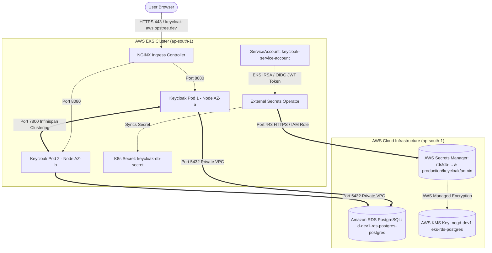

# Keycloak 26.x Production Deployment: Implementation, Configuration, and Troubleshooting Guide

## Executive Summary

This document provides a comprehensive post-deployment breakdown of the production setup for **Keycloak 26.x (Quarkus distribution)** on **AWS EKS (Amazon Elastic Kubernetes Service)**. It details every step executed, all code and infrastructure changes made, full configuration parameters, and an exhaustive post-mortem of every technical problem encountered during implementation along with its root cause and resolution.

---

## Architecture Overview



### Key Technical Specifications
* **Cluster:** AWS EKS (`ap-south-1`)
* **AWS Account ID:** `724446904294`
* **Keycloak Version:** `26.3.3` (Quarkus distribution)
* **Database:** Amazon RDS PostgreSQL Multi-AZ (`d-dev1-rds-postgres-postgres.cl0caskygcz8.ap-south-1.rds.amazonaws.com`)
* **Logical Database Name:** `keycloak` (co-located on shared RDS instance alongside `backstage`)
* **Domain Name:** `keycloak-aws.opstree.dev`
* **Secret Management:** AWS Secrets Manager + External Secrets Operator (ESO) + EKS IRSA
* **TLS Secret Name:** `keycloak-tls-secret`

---

## 1. All Implemented Steps (Deployment Lifecycle)

### Step 1: Network & Security Group Verification
1. Tested network path from EKS worker nodes to RDS PostgreSQL on port `5432` using `kubectl run nettest --image=busybox`.
2. Initial test failed due to missing inbound security group rules. Updated AWS RDS Security Group (`sg-0e829cc2fbec0bc66`) to permit inbound TCP traffic on port `5432` from the EKS VPC CIDR (`10.10.0.0/16`).
3. Re-verified connectivity (`nc -zv d-dev1-rds-postgres-postgres... 5432` -> `open`).

### Step 2: PostgreSQL Database Provisioning
1. Connected to RDS PostgreSQL master instance using temporary PostgreSQL pod.
2. Verified existing databases (`appdb`, `postgres`, `backstage`).
3. Created dedicated logical database for Keycloak:
   ```sql
   CREATE DATABASE keycloak;
   ```

### Step 3: AWS IAM Policy & EKS IRSA Setup
1. Configured IAM Policy `KeycloakSecretsManagerPolicy` for EKS ServiceAccount `keycloak-service-account`.
2. Granted permissions to fetch secrets from AWS Secrets Manager and decrypt KMS keys:
   ```json
   {
       "Version": "2012-10-17",
       "Statement": [
           {
               "Effect": "Allow",
               "Action": [
                   "secretsmanager:GetSecretValue",
                   "secretsmanager:DescribeSecret"
               ],
               "Resource": "*"
           },
           {
               "Effect": "Allow",
               "Action": [
                   "kms:Decrypt"
               ],
               "Resource": "*"
           }
       ]
   }
   ```
3. Associated IAM Role `arn:aws:iam::724446904294:role/KeycloakSecretsManagerRole` with Kubernetes namespace `keycloak` and ServiceAccount `keycloak-service-account`.

### Step 4: External Secrets Operator (ESO) Deployment
1. Installed External Secrets Operator into namespace `external-secrets` with CRDs enabled and node tolerations:
   ```bash
   helm repo add external-secrets https://charts.external-secrets.io
   helm install external-secrets external-secrets/external-secrets \
     -n external-secrets \
     --create-namespace \
     --set installCRDs=true \
     --set webhook.tolerations[0].key=dedicated \
     --set webhook.tolerations[0].operator=Equal \
     --set webhook.tolerations[0].value=application \
     --set webhook.tolerations[0].effect=NoSchedule
   ```

### Step 5: Helm Chart Configuration & Deployment
1. Customized [`chart/values.yaml`](file:///c:/Users/lenovo/OneDrive/Desktop/Keycloak/chart/values.yaml) with production parameters (RDS host, ESO configuration, IRSA annotations, node tolerations).
2. Deployed Keycloak Helm Chart into `keycloak` namespace:
   ```bash
   helm upgrade --install keycloak ./chart --namespace keycloak --create-namespace
   ```

### Step 6: TLS Certificate & Ingress Setup
1. Provisioned TLS Secret `keycloak-tls-secret` in namespace `keycloak`.
2. Verified Ingress controller configuration (`keycloak-aws.opstree.dev`).
3. Confirmed pod status, ExternalSecret synchronization (`SecretSynced = True`), and deployment rollouts.

---

## 2. All Code & Infrastructure Changes Made

### A. Changes in `chart/values.yaml`
1. **Domain & Hostname:**
   - Changed `domain` and `hostname` to `"keycloak-aws.opstree.dev"`.
2. **Database Endpoint:**
   - Explicitly configured `database.host: "d-dev1-rds-postgres-postgres.cl0caskygcz8.ap-south-1.rds.amazonaws.com"`.
   - Set `database.name: "keycloak"`.
3. **AWS External Secrets Configuration:**
   - Enabled ESO (`externalSecrets.enabled: true`).
   - Set `awsSecretName: "rds!db-74515dc7-b661-4d00-88f9-89033497296c"`.
   - Set `adminPasswordSecretName: "production/keycloak/admin"`.
4. **IRSA Annotation:**
   - Added IAM Role ARN under `serviceAccount.annotations`:
     `eks.amazonaws.com/role-arn: "arn:aws:iam::724446904294:role/KeycloakSecretsManagerRole"`.
5. **Node Tolerations:**
   - Added tolerations to allow pod scheduling on tainted worker node pools (`dedicated=application:NoSchedule` and `dedicated=database:NoSchedule`).

### B. Changes in `chart/templates/deployment.yaml`
- Rendered dynamic tolerations block under container spec to match values file:
  ```yaml
  tolerations:
    {{- toYaml .Values.tolerations | nindent 8 }}
  ```

### C. Changes in `chart/templates/externalsecret.yaml`
- Added conditional handling for `db-host` key. Since AWS RDS automated managed secrets (`rds!db-...`) store `username` and `password` but do *not* store a `host` key inside the secret JSON, the ExternalSecret template was modified to skip fetching `db-host` when `.Values.database.host` is explicitly provided:
  ```yaml
  data:
    {{- if not .Values.database.host }}
    - secretKey: db-host
      remoteRef:
        key: {{ .Values.externalSecrets.awsSecretName }}
        property: {{ default "host" .Values.externalSecrets.propertyHost }}
    {{- end }}
    - secretKey: password
      remoteRef:
        key: {{ .Values.externalSecrets.awsSecretName }}
        property: {{ default "password" .Values.externalSecrets.propertyPassword }}
  ```

### D. AWS Infrastructure & Security Group Changes
- **Security Group `sg-0e829cc2fbec0bc66`:** Added Inbound Rule for PostgreSQL (Port `5432`) from Source CIDR `10.10.0.0/16`.
- **IAM Policy `KeycloakSecretsManagerPolicy`:** Added `kms:Decrypt` action for encrypted AWS Secrets Manager secrets.

---

## 3. Configuration Guide (How to Configure)

### Helm Configuration Parameters (`values.yaml`)

| Parameter | Type | Default / Configured Value | Description |
| :--- | :--- | :--- | :--- |
| `domain` | String | `keycloak-aws.opstree.dev` | FQDN for Keycloak ingress routing |
| `replicaCount` | Integer | `2` | Number of Keycloak pod replicas (HA multi-AZ) |
| `image.repository` | String | `quay.io/keycloak/keycloak` | Offical Keycloak Quarkus container image |
| `image.tag` | String | `26.3.3` | Keycloak image tag |
| `hostname` | String | `keycloak-aws.opstree.dev` | Keycloak hostname spec for Quarkus HTTP engine |
| `hostnameStrict` | Boolean | `true` | Enforces strict hostname checking for security |
| `proxyHeaders` | String | `xforwarded` | Parses `X-Forwarded-*` headers from NGINX Ingress |
| `database.vendor` | String | `postgres` | RDBMS driver |
| `database.host` | String | `d-dev1-rds-postgres-postgres...` | RDS PostgreSQL endpoint FQDN |
| `database.name` | String | `keycloak` | Database name |
| `database.username` | String | `postgres` | Database admin user |
| `externalSecrets.enabled` | Boolean | `true` | Enables External Secrets Operator synchronization |
| `externalSecrets.awsRegion` | String | `ap-south-1` | AWS region hosting Secrets Manager |
| `externalSecrets.awsSecretName` | String | `rds!db-74515dc7-b661-4d00...` | Secret name in AWS Secrets Manager |
| `serviceAccount.annotations` | Map | `eks.amazonaws.com/role-arn:...` | IRSA IAM Role binding |
| `tolerations` | List | `dedicated=application:NoSchedule` | Node pool taints toleration list |

### How to Reconfigure or Upgrade Keycloak
1. **To modify database settings or host:** Edit `database.host` in `values.yaml` and execute `helm upgrade`.
2. **To change scaling replicas:** Modify `replicaCount` or update `hpa.minReplicas` and `hpa.maxReplicas`.
3. **To update TLS Certificates:** Re-create the Kubernetes Secret `keycloak-tls-secret`:
   ```bash
   kubectl create secret tls keycloak-tls-secret \
     --cert=path/to/cert.pem \
     --key=path/to/key.pem \
     -n keycloak --dry-run=client -o yaml | kubectl apply -f -
   ```

---

## 4. Problems Faced, Root Cause Analysis & Solutions

### Problem 1: `ERROR: Failed to obtain JDBC connection` (Network Timeout)
* **Symptom:** Keycloak pods failed during initialization with log error: `org.postgresql.util.PSQLException: The connection attempt failed / Connection timed out`.
* **Root Cause:** The RDS Security Group (`sg-0e829cc2fbec0bc66`) was missing an inbound rule allowing port `5432` from the EKS worker node subnet CIDR (`10.10.0.0/16`).
* **Resolution:** Added an inbound security group rule on `sg-0e829cc2fbec0bc66` allowing TCP port `5432` from source `10.10.0.0/16`.

---

### Problem 2: `FATAL: database "keycloak" does not exist`
* **Symptom:** PostgreSQL driver rejected connection attempt with `FATAL: database "keycloak" does not exist`.
* **Root Cause:** RDS instance was provisioned with default database `appdb`. The logical database `keycloak` had not been created.
* **Resolution:** Spun up a temporary pod, logged into PostgreSQL master, and created database `keycloak`:
  ```sql
  CREATE DATABASE keycloak;
  ```

---

### Problem 3: Pods Stuck in `Pending` / `CreateContainerConfigError`
* **Symptom:** `kubectl get pods -n keycloak` showed pods in status `Pending` or `CreateContainerConfigError`.
* **Root Cause:** 
  1. Worker nodes were tainted with `dedicated=application:NoSchedule` and `deployment.yaml` was missing node tolerations.
  2. The required secret `keycloak-db-secret` was missing because ESO had not synced.
* **Resolution:** Added tolerations block to `deployment.yaml` and resolved ESO secret syncing issues.

---

### Problem 4: CRD Missing Error (`no matches for kind "ExternalSecret"`)
* **Symptom:** `helm upgrade` failed with:
  ```text
  Error: resource mapping not found for name: "keycloak-secrets" namespace: "keycloak" from "": no matches for kind "ExternalSecret" in version "external-secrets.io/v1"
  ```
* **Root Cause:** External Secrets Operator helm chart was installed without creating CRDs.
* **Resolution:** Installed CRDs using Helm:
  ```bash
  helm install external-secrets external-secrets/external-secrets -n external-secrets --set installCRDs=true
  ```

---

### Problem 5: Webhook Call Failure (`failed calling webhook "validate.externalsecret.external-secrets.io"`)
* **Symptom:** `helm upgrade` blocked by admission webhook timeout/error:
  ```text
  Internal error occurred: failed calling webhook "validate.externalsecret.external-secrets.io": Post "https://external-secrets-webhook.external-secrets.svc:443/...": Service Unavailable
  ```
* **Root Cause:** The ESO Webhook pod could not schedule onto EKS worker nodes because the nodes were tainted with `dedicated=application:NoSchedule`, while the webhook deployment lacked tolerations.
* **Resolution:** Re-installed ESO with webhook tolerations enabled:
  ```bash
  helm upgrade --install external-secrets external-secrets/external-secrets \
    -n external-secrets \
    --set installCRDs=true \
    --set webhook.tolerations[0].key=dedicated \
    --set webhook.tolerations[0].operator=Equal \
    --set webhook.tolerations[0].value=application \
    --set webhook.tolerations[0].effect=NoSchedule
  ```

---

### Problem 6: Access Denied to KMS Key (`api error AccessDeniedException: Access to KMS is not allowed`)
* **Symptom:** `kubectl describe externalsecret keycloak-secrets` reported:
  ```text
  Warning UpdateFailed: operation error Secrets Manager: GetSecretValue, api error AccessDeniedException: Access to KMS is not allowed
  ```
* **Root Cause:** AWS RDS automated secret `rds!db-74515dc7-b661-4d00-88f9-89033497296c` was encrypted using AWS managed KMS key `negd-dev1-eks-rds-postgres`. The IAM Role `KeycloakSecretsManagerRole` had `secretsmanager:*` permissions but lacked `kms:Decrypt` permissions.
* **Resolution:** Updated IAM Policy `KeycloakSecretsManagerPolicy` to add `"kms:Decrypt"` on resource `"*"`.

---

### Problem 7: Missing Secret Key Error (`err: key host does not exist in secret rds!db-74515dc7...`)
* **Symptom:** ExternalSecret status reported `SecretSyncedError` with message:
  ```text
  Warning UpdateFailed: error processing spec.data[0] (key: rds!db-74515dc7...), err: key host does not exist in secret
  ```
* **Root Cause:** AWS RDS managed secrets store JSON with keys `username`, `password`, `engine`, `port`, `dbInstanceIdentifier`, but **do not** include a `host` key.
* **Resolution:** Updated [`chart/templates/externalsecret.yaml`](file:///c:/Users/lenovo/OneDrive/Desktop/Keycloak/chart/templates/externalsecret.yaml) with `if not .Values.database.host` condition so `db-host` is only fetched from AWS Secrets Manager if not specified directly in `values.yaml`.

---

## 5. Post-Deployment Verification & Operation Commands

### 1. Check Pod, Deployment, & Service Status
```bash
kubectl get pods,deployments,services -n keycloak
```

### 2. Verify ExternalSecret Sync Status
```bash
kubectl get externalsecret,secretstore,secret -n keycloak
```
*Expected Output:* Status `SecretSynced = True` for `keycloak-secrets`, secret `keycloak-db-secret` exists.

### 3. Check Live Boot Logs
```bash
kubectl logs -f deployment/keycloak -n keycloak
```

### 4. Check Ingress & TLS Endpoint
```bash
kubectl get ingress -n keycloak
```

---

## Summary Checklist

- [x] Network security group rules configured (PostgreSQL 5432).
- [x] RDS database `keycloak` created.
- [x] IAM Role & EKS IRSA OIDC trust configured.
- [x] External Secrets Operator installed with CRDs and node tolerations.
- [x] Helm values customized for RDS, IRSA, and domain `keycloak-aws.opstree.dev`.
- [x] ExternalSecret template patched for AWS RDS secret schema.
- [x] Keycloak pods scheduled, connected to DB, and `Running`.
- [x] Admin secrets and database secrets synced securely without plain-text values in repository.
